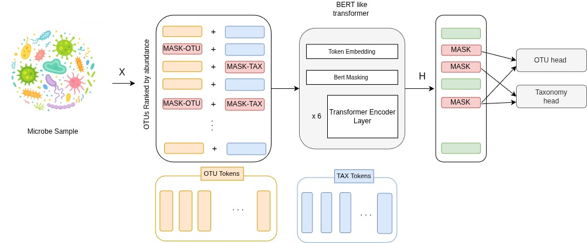

# OTU–Taxa Foundation Model

This repository contains the codebase for developing a **foundation model over
microbiome OTUs and hierarchical taxonomy**, using large-scale datasets derived
from the Microbe Atlas.

The goal of this project is to learn joint representations of:
- OTU abundance patterns across samples, and
- hierarchical taxonomic structure (kingdom → species),

in a way that supports taxonomy-aware pretraining and downstream tasks.

---

## Data

The Microbe Atlas dataset (https://microbeatlas.org/about) was converted into a
model-ready format consisting of:
- OTU vocabularies,
- taxonomy vocabularies and tree artifacts,
- and per-sample OTU/taxonomy index representations.

The code used to construct these datasets and artifacts is documented in:

The code used to construct these datasets and artifacts is documented in
[notebooks/preprocess](notebooks/preprocess/).

The generated data files are large and are therefore stored outside this
repository.  
This repository contains the code needed to reproduce their construction and to
load them during model training. 

---

## Model overview

**Figure 1.** Overview of the OTU–Taxa foundation model. The model jointly encodes
OTU abundance information and hierarchical taxonomy tokens using a shared
Transformer backbone, enabling taxonomy-aware pretraining and downstream tasks.
